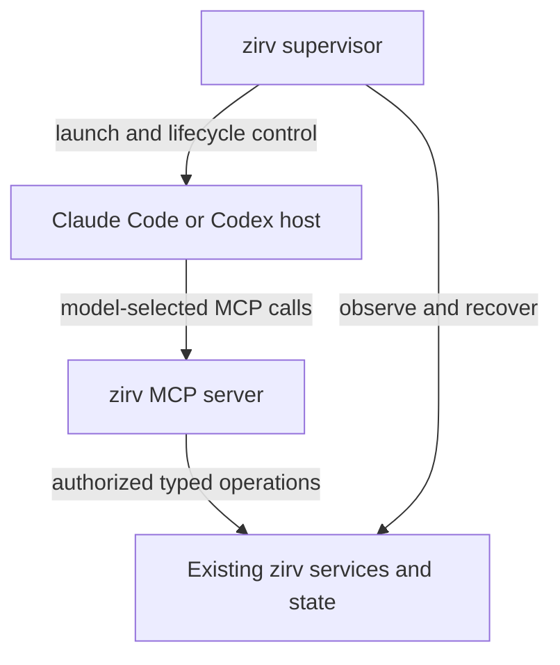

# MCP bridges for the zirv meta-harness

Date: 2026-09-15. Status: research and proposed design; no implementation or client compatibility tests performed.

This note records the pre-implementation research. The first implementation's
scope and verification plan are in [the read bridge plan](../plans/2026-09-15-mcp-read-bridge.md);
the shipped command contract is in the [README](../../../README.md#mcp-bridge).

Repository inspected: `22bfdda11bac083aa2c553c260c62e953ae714a4`, Cargo version `3.47.0`. External capabilities below are documentation-verified, not locally runtime-verified.

## Recommendation

Build one small MCP server in the zirv binary, connected to the existing harness services. Start with structured, scoped access to session status, relevant memory, workflow state, and worker results. Add mail mutations and worker dispatch after their authorization and retry semantics are established.

The expected improvement is more reliable use of the harness: discoverable operations, validated arguments, compact results, and fresh state when the model needs it. MCP does not increase a model's reasoning capacity, guarantee instruction following, or automatically supervise its host application. The performance benefit remains a hypothesis until measured against zirv's existing CLI and generated command schema.

## What is already present

- `src/commands/ctx/prompt.rs:402`: `HARNESS_PROMPT` teaches the model shell commands for status, inbox, delegation, memory, and lifecycle checkpoints. It explicitly directs models to the installed binary's command schema for current syntax.
- `src/commands/ctx/status.rs`: status already has a JSON surface. The session registry, groups, tasks, capacity, and policy machinery supply much of the data a bridge would need.
- `src/commands/ctx/memory.rs` and `retrieval.rs`: durable memory, provenance, ranking, and bounded retrieval already exist. `compile.rs:432` supplies changed files and the active workflow query at compilation; `memory_cli.rs:567` supplies a query for explicit recall. An MCP tool can reuse these services for fresh retrieval as the task changes.
- `README.md:335`: mail is durable and carries an explicit trust distinction. Interactive sessions receive unread advisories; headless sessions receive mail at launch. `README.md:389` explains that nudging a headless session can restart it, while interactive nudges are advisory.
- `README.md:378`: worker reports are already persisted, and delegation receipts can reference the full result. A bridge should reuse this result store.
- `src/commands/ctx/policy.rs`: permission outcomes distinguish actual enforcement from advisory policy. Preserve that distinction in tool responses.

There is no zirv MCP server in the inspected source or dependency list. Most of the proposed value comes from exposing existing services through a model-facing contract.

## Proposed architecture

Possible new command, **not implemented**: `zirv ctx mcp serve --stdio`.

The host starts a local server process using the same installed zirv binary. The launcher provides the authorized session binding. For operations that require live supervisor state, use a defined internal request/snapshot interface; a child MCP process cannot directly access its parent's in-memory state. Existing durable stores remain authoritative for mail, results, and memory.

Use ordinary MCP tools as the initial interface. Add resources for larger documents and artifacts where useful, with a tool-based fetch path for clients that do not surface resources conveniently. Prompts can supply optional user-invoked workflows; they should not carry required policy enforcement.

MCP provides schemas for tool arguments and structured results. That supplies a suitable wire contract; validation and domain rules still belong in zirv. [MCP tools](https://modelcontextprotocol.io/specification/2026-07-28/server/tools)

## Suggested tool surface

Names in this table are proposals, not existing commands.

| Priority | Tools | Useful result and purpose |
|---|---|---|
| First | `session_snapshot` | Caller identity and scope, applicable policy, authorized worker summaries, unread count, workflow step, and available health/capacity observations. Include collection time and unavailable/stale markers. |
| First | `memory_search` | Query-relevant entries with source, trust scope, verification date, and bounded text. Reuse retrieval ranking and trusted-key precedence. |
| First | `workflow_status`, `artifact_read` | Current requirements and evidence, plus bounded access to authorized worker results and handoffs. Artifact IDs resolve through a registry rather than unrestricted filesystem paths. |
| Second | `mail_read`, `mail_ack`, `mail_send` | Stable message IDs, sender provenance, explicit acknowledgement, and receipts. Reading and acknowledgement must have distinct side-effect semantics. |
| Second | `worker_start`, `worker_status`, `worker_cancel` | Validated launch request, immediate durable job handle, status, result references, and scoped cancellation. Worker creation uses an idempotency key. |
| Later | `memory_put`, `checkpoint_save` | Provenance-preserving durable facts and task continuity. Require conflict detection and distinguish agent claims from supervisor-verified evidence. |

For example, after changing focus from rendering to authentication, a model calls `memory_search` with that query and relevant paths. The server returns a few ranked facts and their provenance. After dispatch, `worker_status(job_id)` returns whether the work succeeded and where its report lives. These operations reduce shell-syntax and output-parsing work, while their semantic results stay equivalent to the CLI.

Avoid a generic `run_command` bridge and automatic exposure of every CLI verb. A compact tool set makes the available actions easier to understand and permits specific authorization rules.

## Current client and protocol findings

### Codex

Official documentation supports local stdio and Streamable HTTP MCP servers, command arguments, environment forwarding, per-tool filtering, timeouts, and server-wide instructions. This makes a local zirv tool bridge feasible. Compatibility with the versions zirv actually launches still needs a real connection test. [Official OpenAI MCP documentation](https://learn.chatgpt.com/docs/extend/mcp?surface=cli)

For deeper control of Codex itself, App Server exposes turns, streaming events, interruption, and steering. Adopting it would be a separate adapter project. Its user-input steering API must not be used to promote arbitrary worker mail into operator instructions. The documentation also describes tool-output delivery, which preserves the content's tool-output role. [Codex App Server](https://learn.chatgpt.com/docs/app-server)

### Claude Code

Claude Code supports MCP tools and resources. Tool search can defer tool definitions, making concise server instructions important for discovery. Deferral depends on the client's model/provider configuration, so context savings must be measured. [Claude Code MCP documentation](https://code.claude.com/docs/en/mcp)

Claude's `claude/channel` extension can deliver incoming events to a session. The documented custom-channel path is still a research preview with explicit opt-in and allowlist restrictions. Investigate it as an optional mail/worker-completion advisory path. It is not portable core MCP behavior, and adopting it must preserve zirv's current distinction between external information and operator authority. [Channels reference](https://code.claude.com/docs/en/channels-reference)

### MCP version changes matter

The current published revision is 2026-07-28. It changes the session/negotiation model, moves tasks to an optional extension, changes subscriptions, and deprecates sampling. Consequently, keep zirv session/job identity explicit and durable, support the protocol versions used by target clients, and avoid building delegation around MCP sampling. SDK support does not establish client support. [MCP revision changes](https://modelcontextprotocol.io/specification/2026-07-28/changelog)

The official Rust `rmcp` SDK provides Tokio integration, tool schemas, and stdio support. It fits zirv's existing Rust/Tokio implementation. Pin a compatible release and inspect its protocol support and dependency impact during implementation. Start with stdio; add authenticated Streamable HTTP only for a concrete remote/shared-server need. [Official Rust SDK](https://github.com/modelcontextprotocol/rust-sdk), [MCP transports](https://modelcontextprotocol.io/specification/2026-07-28/basic/transports)

## Required design properties

1. **Authorization on every operation.** Bind the caller to a supervisor-established identity, repo/worktree scope, role, and effective policy. Public session IDs and model-provided role fields are selectors, not proof of authority. Recheck target ownership for reads, dispatch, mail, and cancellation.
2. **Preserve the repository trust boundary.** Repository configuration must not choose an arbitrary bridge executable or widen permissions. Reuse the actual installed binary and operator-controlled launch configuration. Memory and worker reports retain their untrusted-content labels.
3. **Enforce tool effects explicitly.** A host's shell restriction does not automatically constrain an MCP server. The current Claude adapter explicitly reports that denying Write/Edit/Bash/NotebookEdit leaves MCP tools available (`adapters/claude.rs:2304`). Read-only roles must therefore be denied mutating bridge operations by the server itself, regardless of whether a client hides them.
4. **Do not overstate process isolation.** Current pane request channels authenticate the ordinary inherited-channel path, but source comments record a same-UID discovery limitation tracked in issue #179 (`dash/spawnreq.rs:352`). A session token alone is not an OS security boundary. Resolve the relevant isolation requirement before promising mutually untrusted workers cannot impersonate each other.
5. **Make retries safe.** Give launches and sends idempotency keys, memory updates conflict checks, and mailbox reads stable IDs plus acknowledgement. A transport timeout must not cause duplicate workers or silently lost mail. Persist job identity independently of an MCP connection.
6. **Bound output and preserve evidence.** Return short summaries, limits, cursors, freshness, and scoped artifact handles. A successful tool request is distinct from successful worker execution or passing tests. Report unknown health/capacity as unknown.
7. **Keep supervision independent.** Bridge failure must leave the wrapper's passthrough and recovery paths working. Do not place a blocking MCP call on the PTY hot path. Required checkpoints still need hooks, short standing instructions, or a verified host-specific mechanism; a discoverable tool alone cannot ensure the model calls it.

## Delivery and evaluation

**Phase 1: read access.** Implement the typed service boundary and approximately four tools: snapshot, memory search, workflow status, and artifact read. Register for wrapped Codex and Claude sessions using reversible, launch-scoped configuration where supported. Preserve unrelated user MCP configuration. Verify interactive and headless launches on supported platforms, including Windows executable/shim behavior.

**Phase 2: controlled effects.** Add mail and worker tools with server authorization, idempotency, durable receipts, and restart/reconnect tests. Treat this as substantial work because it affects coordination and trust boundaries.

**Phase 3: event delivery.** Evaluate Claude channels and, separately, a Codex App Server adapter. Keep existing advisories as the compatibility path. Ordinary resource notifications must not be assumed to wake a model or start a turn.

Compare the same tasks, models, budgets, and underlying services through (A) current CLI plus command-schema discovery and (B) MCP. Use repeated trials and include both cold and warm starts. Scenarios should cover task-dependent memory retrieval, reading a large worker report, two worktrees, a dropped response after dispatch, and session recovery with unread mail.

Measure task correctness, failed harness calls, duplicate/lost work, completion-to-awareness delay, operator interventions, wall time, and total input/output tokens including discovery, schemas, result text, and cache effects. Separately test forged session identity, denied mutations, cross-repo artifact access, disconnects, and bridge crashes.

Proceed beyond the initial bridge only if it improves correctness or coordination effort without material latency/token regressions. No numerical improvement is established by this research. No Rust files were changed and no build/test checks were required for this research note.
